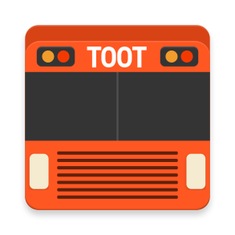

 

# Toot

Toot is an event bus designed to decouple different parts of your application while still allowing them to communicate efficiently.

Forked from Otto (which in turn forked from Guava), Toot adds the speed of using compile time code generation, rather
than using reflection like the predecessors. On top of that, Toot supports subscribers in super classes, and doesn't
throw an exception if you try to unregister a class which is not registered (optional, but defaults to off).

*For usage instructions please see [the website](http://oriley-me.github.io/toot).*

## License

    Copyright 2016 Kane O'Riley
    Copyright 2012 Square, Inc.
    Copyright 2010 Google, Inc.

    Licensed under the Apache License, Version 2.0 (the "License");
    you may not use this file except in compliance with the License.
    You may obtain a copy of the License at

       http://www.apache.org/licenses/LICENSE-2.0

    Unless required by applicable law or agreed to in writing, software
    distributed under the License is distributed on an "AS IS" BASIS,
    WITHOUT WARRANTIES OR CONDITIONS OF ANY KIND, either express or implied.
    See the License for the specific language governing permissions and
    limitations under the License.